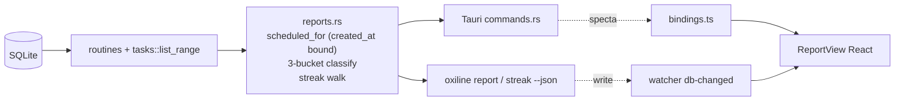

# Habit Streak / Weekly Report — Design Spec

- **Date:** 2026-07-30
- **Status:** Approved (converged via brainstorming); ready for implementation plan
- **Scope:** New feature pulled forward from `08-roadmap.md` Phase 3 (re-evaluation candidate)
- **Surfaces:** `oxiline-core` (new `reports` module) + `oxiline-cli` (2 subcommands) + `oxiline-app` (new Report tab)

## 1. North Star & Product Constraint

OxiLine is an **execution-aid, not a motivation app** (`01-product-vision.md` §1.6: "동기부여형 앱이 아니라 실행 보조 도구"). This feature is **descriptive, not prescriptive**: it shows what happened as plain facts and **never judges** — no "failed", "broke your streak", fire emoji, scoreboard, penalty color, or score.

The roadmap (`08-roadmap.md` Phase 3) gates this feature on exactly one rule: **"게이미피케이션이 아니라 완료율을 담백하게 보여주는 수준으로 제한."** The three-bucket model (§2.2) is the embodiment of that rule. This constraint propagates into both the data model and UI copy.

### Explicit Non-goals (v1)
- ❌ "Best streak" / all-time max scoreboard — reintroduces a thing-to-beat. `current` consecutive days only.
- ❌ Daily pass/fail judgment ("100% day", "streak saved"). No per-day verdict.
- ❌ Fire/trophy/leaderboard visuals; green-success vs red-failure coloring.
- ❌ Notifications/nagging based on streak state.
- ❌ Sharing, export-as-image, social.

## 2. Core Semantics (the trust foundation)

### 2.1 Scheduled-set reconstruction + `created_at` bound (bug fix)

To classify a past date `D`, the system reconstructs "what was scheduled on `D`". A routine block `b`'s occurrence counts as **scheduled on `D`** iff **all four** hold:

1. `b.is_active == true`
2. `routines::mask_includes(b.weekday_mask, weekday_of(D))`
3. `in_effective_range(b.effective_from, b.effective_until, D)`
4. **`D >= bound_date`, where `bound_date = max(effective_from_date, created_at_date)`** ← NEW

**Why (4) is mandatory, not optional:** `timeline.rs:76-97` currently checks only (1)–(3). A permanent routine (`effective_from = NULL`, the default) created on Wednesday would surface as a virtual occurrence (`is_done=false`) on Monday/Tuesday of the same week — i.e. marked "scheduled but not done" on days the routine did not yet exist. This is (a) an accuracy bug and (b) a direct violation of the no-guilt Non-goal: a brand-new routine's first weekly report would open with 2–5 phantom "not done" days.

(4) is encoded in a single helper `reports::scheduled_for(block, date)` that is **scoped to the reports module only** — `day_breakdown` reconstructs the scheduled set itself (it does *not* call `timeline::get_timeline_for_date`), so `timeline.rs` is untouched by this feature.

> **Scope note — timeline/WeekView phantom occurrences:** the same pre-`created_at` bug also affects the GUI WeekView, which renders past days of the current week through `get_timeline_for_date`. That fix is **deliberately out of scope here**: applying the bound to `timeline.rs` would break 3 existing tests (`timeline_emits_virtual_occurrence_for_matching_weekday`, `manual_task_and_virtual_merge_and_sort`, `effective_period_bounds_visibility`) whose fixtures stamp `created_at` to real-*now* via `routines::create` (which has no back-date path) while querying fixed past dates. It is tracked as a **separate follow-up** requiring test-fixture back-dating plumbing, not part of this feature.

> Caveat: `created_at` is stored ISO 8601 UTC (`03-data-model.md` §3.3) while date/time columns are local wall-clock. For this single-user local app we compare **date portions only**; the sub-day UTC/local offset is negligible and documented in-code.

### 2.2 Three-bucket classification

Every scheduled occurrence on `D` — whether a materialized `tasks` row or a virtual occurrence — falls into **exactly one** bucket:

| Bucket | Condition | In completion-rate denominator? |
|---|---|---|
| `done` | `is_done == 1` | yes (numerator) |
| `skipped` | `is_skipped == 1` | **no** — neutral, shown as its own bucket |
| `not_recorded` | `is_done == 0 AND is_skipped == 0` | **yes** (denominator only) |

$$\text{completion\_rate} = \frac{\text{done}}{\text{done} + \text{not\_recorded}}, \qquad \text{denominator } 0 \Rightarrow \text{completion\_rate} = \texttt{None}$$

`not_recorded` is **a neutral fact ("체크인 없음" / "no check-in"), neither a verdict nor a concealment.** This is the resolution chosen over both the strict option (= missed judgment → guilt) and the lenient option (= exclude → inflates the rate to meaninglessness). Showing all three buckets plainly is the most precise reading of "담백하게 보여주는."

Whether a `not_recorded` item is a materialized-but-incomplete task or an untouched virtual occurrence does not change its bucket — both are "scheduled, neither done nor explicitly skipped."

### 2.3 Temporal boundary — future / not-yet-due excluded

A weekly report can be generated mid-week; not-yet-elapsed items must not count as `not_recorded`:

- `D < today` (past day): all scheduled occurrences are **due** → classified into one of the three buckets.
- `D == today`, **timed** occurrence (`start_minute` present): due iff `start_minute + duration_minute <= now_minute`; due ones classify, the rest are **`upcoming`** (own bucket, never in the rate).
- `D == today`, **untimed** occurrence (`start_minute` is None — a date-only manual task): treated as **available all day → due** (classify, never `upcoming`). Rationale: an untimed item can be done at any point in the day, so a same-day live report must be able to show it as `not_recorded` mid-day rather than hiding it as perpetually-upcoming until midnight. (Timed vs untimed is decided by `start_minute`, independent of source; this rule is local to reports and does not alter the existing `now-context`/timeline logic, which only ever reasons about timed items.)
- `D > today` (future day): the whole day is excluded from completion aggregation; its scheduled count rolls into `upcoming` totals only.

### 2.4 Per-routine current streak

A routine's **current consecutive-done count**, computed by walking its scheduled occurrences backward:

1. Enumerate scheduled occurrences of the routine from `bound_date` (§2.1) through today, newest → oldest.
2. If the most recent scheduled occurrence is **today** and is not `done`, do **not** evaluate today as a break (the day isn't over) — begin counting from the previous scheduled occurrence.
3. Walk backward:
   - `done` → streak `+1`
   - `skipped` → **transparent** (neither advances nor breaks — intentional rest, consistent with §2.2 neutral treatment)
   - `not_recorded` (a past occurrence) → **stop** (= a break, but **no "failure" label**)

Output: `current: u32` and `last_done_date: Option<String>`. No `best` (Non-goal, §1).

## 3. Architecture — new core module `reports.rs`

Just as `timeline.rs` is the single source of truth for timeline merging, **`reports.rs` is the single source of truth for all completion/streak arithmetic.** Both CLI and GUI call into it. Pure synchronous functions; all output structs derive `specta::Type` (`#[serde(rename_all = "snake_case")]`).

### 3.1 New domain types (`model.rs`)

```rust
#[derive(Serialize, Deserialize, Type, Clone, Debug)]
pub struct DayBreakdown {
    pub date: String,
    pub done: u32,
    pub skipped: u32,
    pub not_recorded: u32,           // due, not done, not skipped (virtual OR materialized-incomplete)
    pub upcoming: u32,               // scheduled but not yet due (today/future)
    pub completion_rate: Option<f64>,// done/(done+not_recorded); None when denominator 0
    pub categories: Vec<CategoryBreakdown>,
}

#[derive(Serialize, Deserialize, Type, Clone, Debug)]
pub struct CategoryBreakdown {
    pub category_id: Option<String>,
    pub category_name: String,
    pub done: u32,
    pub skipped: u32,
    pub not_recorded: u32,
    pub completion_rate: Option<f64>,
}

#[derive(Serialize, Deserialize, Type, Clone, Debug)]
pub struct DayTotals {
    pub done: u32,
    pub skipped: u32,
    pub not_recorded: u32,
    pub upcoming: u32,
}

#[derive(Serialize, Deserialize, Type, Clone, Debug)]
pub struct WeekReport {
    pub week_start: String,
    pub week_end: String,
    pub days: Vec<DayBreakdown>,
    pub totals: DayTotals,
    pub completion_rate: Option<f64>,
    pub prev_completion_rate: Option<f64>,  // prior week's rate — neutral: render two numbers, NEVER "improved!/dropped" framing
    pub categories: Vec<CategoryBreakdown>,
    pub streaks: Vec<RoutineStreak>,        // current streak per active routine (cheap to include; one round-trip)
}

#[derive(Serialize, Deserialize, Type, Clone, Debug)]
pub struct RangeReport {            // generic N-day aggregation (last 7/30 days, arbitrary range)
    pub from: String,
    pub to: String,
    pub days: Vec<DayBreakdown>,
    pub totals: DayTotals,
    pub completion_rate: Option<f64>,
    pub categories: Vec<CategoryBreakdown>,
    pub streaks: Vec<RoutineStreak>,
}

#[derive(Serialize, Deserialize, Type, Clone, Debug)]
pub struct RoutineStreak {
    pub routine_id: String,
    pub title: String,
    pub current: u32,               // consecutive done (transparent over skipped; stops at not_recorded)
    pub last_done_date: Option<String>,
}
```

### 3.2 Public functions (`reports.rs`)

```rust
/// The scheduled-on-date predicate (§2.1, all four conditions incl. created_at bound).
/// Reports-module-local; `timeline.rs` is unchanged (see §2.1 scope note).
pub fn scheduled_for(block: &RoutineBlock, date: &str) -> bool;

/// Reconstruct the merged scheduled set for `date` (materialized tasks + virtual occurrences
/// with the created_at bound applied), classified into the three buckets. `now_minute` governs
/// the today/upcoming split (§2.3).
pub fn day_breakdown(conn: &Connection, date: &str, now_minute: u16) -> Result<DayBreakdown>;

/// Current week, honoring `settings.week_starts_on` (default "mon").
pub fn week_report(conn: &Connection, today: &str, now_minute: u16) -> Result<WeekReport>;

/// Generic inclusive [from, to] aggregation.
pub fn range_report(conn: &Connection, from: &str, to: &str, today: &str, now_minute: u16) -> Result<RangeReport>;

/// Current streak for one routine (§2.4). `today` = local date string.
pub fn routine_streak(conn: &Connection, block_id: &str, today: &str) -> Result<RoutineStreak>;

/// Current streak for every active routine.
pub fn routine_streaks(conn: &Connection, today: &str) -> Result<Vec<RoutineStreak>>;
```

Implementation notes:
- Pull materialized rows via the existing `tasks::list_range` / `tasks::list_by_date`; pull active routines via `routines::list(conn, true)`.
- Category name resolution via `categories` (fallback to the i18n "기타/Other" name when `category_id` is null/unknown).
- `week_report` derives `week_start` from `today` + `settings.week_starts_on`, then delegates per-day work to `day_breakdown`; `prev_completion_rate` comes from a second `range_report` over the prior 7 days.

## 4. CLI — two new subcommands

Follows existing patterns (`05-cli-spec.md`): clap derive in `cli.rs`, `--json`, error schema §5.4, exit codes §5.5. **Read-only.**

```
oxiline report [--week|--last <N>|--range FROM:TO] [--json]   # default: --week (current week)
oxiline streak [<routine-id|name>] [--json]                     # no arg → all active routines
```

- `report` resolves to `week_report` (`--week`), `range_report` last-N days (`--last`), or `--range FROM:TO`. `--json` emits `WeekReport`/`RangeReport`.
- `streak` resolves id/name like existing commands; unknown → exit 3 `not_found`, ambiguous name → exit 2 `invalid_argument`.

Human-mode output (dry, factual; ko/en via `lang.rs`). Example `oxiline report`:

```
2026-07-28 ~ 08-03 (이번 주)
완료 35 · 건너뜀 4 · 체크인 없음 8 · 예정 6
완료율 81%   저번 주 65%

카테고리
  업무   12/14  86%      학습   9/12  75%
  건강    8/10  80%      휴식   6/ 8  75%

루틴 연속
  아침 운동   12일
  집중 작업    5일
  출근 준비    0일
```

Copy rule: never "실패/깨짐/놓침"; `not_recorded` renders as "체크인 없음" (neutral fact).

## 5. GUI — new Report tab in the main window

Add a 4th tab to the view switcher: `[오늘][주간][백로그][리포트]` (keyboard `4`, extending `07-ui-screens-and-flows.md` §7.10). New component `ReportView.tsx`; new Tauri commands in `commands.rs` (thin wrappers, `#[tauri::command]` + `#[specta::specta]` + `map_err`, registered in the existing `generate_handler!`):

```rust
pub fn get_week_report(state) -> Result<WeekReport, String>;
pub fn get_range_report(state, from: String, to: String) -> Result<RangeReport, String>;
pub fn get_routine_streaks(state) -> Result<Vec<RoutineStreak>, String>;
```

tauri-specta emits TS bindings; React fetches via React Query; the existing `db-changed` watcher event (`04-architecture.md` §4.5) invalidates the report query keys.

Layout (ASCII, matching project doc convention):

```
┌───────────────────────────────────────────────┐
│ ● ● ●   2026년 7월 30일 (목)        ⌘K  ⚙     │
│ [오늘] [주간] [백로그] [리포트]                 │
├───────────────────────────────────────────────┤
│  이번 주 ▾    07-28 ~ 08-03                    │  ← period selector (이번 주/저번 주/최근 30일)
│                                                │
│  ▓▓▓▓▓▓▓▓▓░░░░  81%      저번 주 65%           │  ← 7-segment oxide bar (done=filled, not_recorded=faint)
│                                                │
│  완료 35   건너뜀 4   체크인 없음 8   예정 6    │  ← three buckets, NEUTRAL colors (no green/red verdict)
│                                                │
│  카테고리                                       │
│  업무   ▓▓▓▓▓▓▓▓▓░  86%  (12/14)               │
│  건강   ▓▓▓▓▓▓▓▓░░  80%  ( 8/10)               │
│  ...                                           │
│                                                │
│  루틴 연속                                      │
│  아침 운동   12일                               │  ← integer only, no dots/fire
│  집중 작업    5일                               │
└───────────────────────────────────────────────┘
```

### Design-system discipline (`06-design-system.md`)
- `not_recorded` uses a **neutral muted token** — `--text-tertiary` / `--surface-sunken` / `--border-default`. **Never `signal-rust`** (that hue 35 is reserved for warnings/delays per §6.2; using it here would imply failure).
- `done` uses the occurrence's category hue (`categories.color_hue`). Brand `--accent-oxide` (hue 189) for the overall rate bar only.
- No green-success vs red-failure. The oxide-bar segments convey state by *fill density*, not hue judgment.
- Copy: "체크인 없음" (neutral); never "놓침/실패/깨짐". Period selector and numbers only — no exclamation framing on `prev_completion_rate`.

## 6. Data flow



GUI↔CLI sync reuses the existing §4.5 mechanism (`notify` → `db-changed` → React Query invalidate); report query keys are invalidated by the same event.

## 7. Testing — pure Rust, `oxiline-core/tests/reports.rs`

Follows the existing `tests/timeline.rs` pattern. Each test defends an observable contract:

1. **`created_at` bound** — permanent routine created Wed → Mon/Tue of that week are **not** scheduled (denominator 0, rate `None`). This is the headline regression guard for the bug fix.
2. **Three-bucket classification** — a mix of done/skipped/(virtual + materialized-incomplete) lands in the right buckets; counts exact.
3. **Denominator correctness** — `skipped` and `upcoming`/future excluded; denominator 0 → `None` (not 0%).
4. **Streak walk** — consecutive `done` counts; `skipped` transparent (streak survives a skip); past `not_recorded` stops it; today-not-done does **not** stop it.
5. **Mid-week report** — future days excluded from completion aggregation; rolled into `upcoming`.
6. **`effective_from` precedence** — a routine with `effective_from` in the future is unscheduled before it (bound = `max(effective_from, created_at)`).
7. **Untimed-today rule** — a date-only manual task (no `start_minute`) on today shows as `not_recorded` (in the denominator) mid-day, not `upcoming`; a timed today-item before its start stays `upcoming`.

## 8. Error handling & edge cases

- Read-only queries; reuse `CoreError` / `ErrorCode`.
- Routine id/name resolution reuses the existing pattern (ambiguous → `not_found`/`invalid_argument`).
- Empty DB → all-zero counts / `None` rates; CLI/GUI render a friendly empty-state line (e.g. "아직 기록이 없어요") consistent with `07-ui-screens-and-flows.md` §7.11.
- **Inactive routines** (`is_active=0`): excluded from the streak list, and their virtual occurrences are **not** reconstructed by `scheduled_for` (which checks *current* `is_active`). However, their past **materialized** `tasks` rows persist in the DB and still appear in range/week aggregates. This asymmetry is intentional and forgiving — deactivating a routine does **not** retroactively spawn phantom `not_recorded` days against you (only your done/skipped history remains), and it is the only sound behavior given there is no `is_active` history log. Documented in-code; a future audit-log migration could make past active-state reconstructable if ever needed.

## 9. Out of scope (future, if ever)

- `best` / all-time-max streak (deliberate Non-goal; trivially addable).
- Per-day verdict, streak "saved" notifications, sharing/export-as-image.
- Cross-category "perfect day" scoring.
