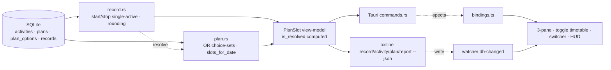

# OxiLine v2 — Recording-Centered Day Design Spec

- **Date:** 2026-08-01 (converged after UI iteration; supersedes the first "Record Layer" draft in this same file)
- **Status:** Drafted + self-reviewed; awaiting user sign-off before the implementation plan
- **Scope:** A full re-centering of OxiLine around **recording what you actually do**, on a desktop **timetable of cards**, where **plans are OR choice-sets** and completion is **recorded time, not a checkbox**
- **Canonical mockup:** [`2026-08-01-final-mockup.html`](./2026-08-01-final-mockup.html) (interactive `[계획|실제|둘 다]` toggle, 3-pane desktop, responsive)
- **Surfaces:** `oxiline-core` (`record` + `plan` modules, `V4` migration) · `oxiline-cli` (`record`, `activity`, `plan` groups) · `oxiline-app` (enlarged 3-pane window, toggle timetable, switcher, HUD, date dropdown, responsive)
- **Builds on (do not reinvent):** existing `DayTimeline.tsx` / `BlockView.tsx` (card layout, dnd, resize), `cards.rs` (card templates), `categories`, `reports.rs` (neutral aggregation pattern)

---

## 1. North Star — the playhead records; plans are loose sheet music

OxiLine's core metaphor is the **playhead** gliding over a tape (`01-product-vision.md` §1.1). This design makes the playhead a **recording head**: it captures what you *actually* do, on a wide **timetable of cards** you sketch ahead of time.

Two facts reframe the product:

1. **Recording is the truth; the plan is loose.** What you intended is a *guide*; what you recorded is *what happened*. Completion is **having recorded time on a thing** — there is no done-checkbox anywhere.
2. **A plan slot is an OR (a choice-set).** At a given time you may have several alternative activities ("코딩 *or* 독서 *or* 운동 around 11am"); you pick one when you get there. A plan is a **menu**, not a commitment to do all of them.

The timetable therefore holds **two independent streams** that the user reads together:

| Stream | Question | Entity | Visual |
|---|---|---|---|
| **Plan** | "What did I intend / what are my options?" | `plan` (a slot with N `activity` options) | dashed, hollow dots, OR-tagged |
| **Actual** | "What did I actually record?" | `record` (one open at a time) | solid, filled dots, shadowed |

The `[계획 \| 실제 \| 둘 다]` toggle chooses what the canvas shows. **둘 다** splits the canvas into two lanes (plan left, actual right) so the two never visually collide — the resolution ("I had these options; I did this one") is read across one time row.

### 1.1 What this supersedes (legacy, ignored per directive)

The original `03-data-model.md` model — `routine_blocks` + `tasks` with `is_done`/`is_skipped` + the materialize-on-interaction machinery — is **retired**. Its functions are absorbed:
- "recurring routine" → a **recurring `plan`** (weekday-mask choice-set).
- "task + done checkbox" → an **activity + a `record`** (done = a record exists).
- "materialize occurrence" → gone; plan-slots are **computed per date** at view time, never stored as checkbox rows.

Migration of existing user data is out of scope here (greenfield target model); a one-time import (`routine_block → recurring plan`, `task.is_done → a same-day record`) is a flagged follow-up, not part of this spec.

### 1.2 Non-goal discipline (carried from the habit-streak spec)

Budgets + "achievement" press against vision §1.6 (no gamification). Budgets are **reality feedback — a plain ratio, never a verdict**: no streaks, scores, fire/trophy, "budget broken," or punitive color. Over is not failure; met is not a win. Weekly is the primary lens (it smooths a single bad day).

---

## 2. Glossary

| 한글 | Code | Meaning |
|---|---|---|
| 활동 | `activity` | A predefined kind of work you can plan *or* record. Carries a hue label, optional category, optional daily/weekly budget. |
| 계획 | `plan` | A planned time slot holding **1..N alternative activities** (OR). 1 option = a simple block; N = a choice-set. `once` or `recurring`. |
| 선택지 | `plan_option` | One alternative within a plan (an activity reference). |
| 기록 | `record` | An actual recorded interval of one activity (`started_at`→`ended_at`). The **only** truth. One open at a time. |
| 녹화 중 | `active` | An activity with an open record (`ended_at IS NULL`). |
| 충족도 | `compliance` | `recorded / target` per activity — a plain ratio, never a verdict. |
| 전환 | `switch` | Stop the current record and start another (single-foreground). |
| 반올림 단위 | `rounding_increment` | Recorded durations snap to this (default 5 min). |

---

## 3. Core semantics

### 3.1 Two independent streams, linked by *computed* resolution

Plans and records are **not** foreign-keyed to each other. Each is an independent stream; the "which option got done" link is **derived at query time**:

> A record `R` (activity `A`, interval `[Rs, Re]`, local date `D`) **resolves** a plan `P` for date `D` iff **`A ∈ P.options`** AND **`overlap([Rs,Re], [P.start, P.start+P.dur]) > 0`**.

Consequences (all desired):
- A record with **no** matching plan → off-plan; still shown in the actual lane, plan lane empty there (reality diverged upward).
- A **past** plan with no resolving record → unfulfilled; shown as an open choice in the plan lane, actual lane empty there (neutral, **not** "missed/failed").
- A plan resolved by a record → the actual lane shows what you did, aligned to the plan row. "9시엔 코딩/독서 OR → 코딩 기록."

Keeping the link derived (not stored) means plans and records never drift, and the same record can satisfy a recurring plan on each matching day without duplication.

### 3.2 Plans are OR (choice-sets)

A plan is a **menu of alternatives** at a time window. Creating a plan means placing a slot and adding 1..N activity options. In the plan lane it renders as one dashed group listing its options with an **OR** tag. The user satisfies it by recording *any one* option near that time. This is the structural expression of "이 계획들은 OR임."

### 3.3 Recording lives on the timetable, single-active

Recording state is **in the database, not a timer process**: a record is open when `ended_at IS NULL`; elapsed is always `now − started_at`. `start(A)` atomically (one WAL transaction) closes any open record and opens one for `A` — the **single-active invariant** (screentime/전환 model). Every start/stop flows through `record::start`/`record::stop` in core, so the invariant holds for both CLI and GUI.

Why single-active (not concurrent overlay): non-overlapping records **partition** the recorded part of the day, so $\sum_a \text{recorded}_a \le \text{waking hours}$ and per-activity budgets stay coherent. Concurrent overlay double-counts wall-clock and breaks that — documented as a conscious future fork (§12), not v1.

### 3.4 Completion = a record exists (no checkbox)

There is **no `is_done`**. "Did I do 아침운동?" is answered by "is there a record of it today?" A plan is *done* iff a record resolves it (§3.1). This is the single biggest premise change vs. the legacy task model.

### 3.5 Recorded time rounds to an increment

A setting `record_rounding_minutes` (default **5**; 0 disables) snaps every *derived* duration to that increment (round-half-up). A 42-minute session counts/displays as **40m**; 1–2 minutes are deliberately ignored. Precise `started_at`/`ended_at` instants are still stored (for the live timer and audit) — only **durations** round. Weekly/daily compliance, the actual-lane block heights, and the now-card elapsed all use the rounded duration.

### 3.6 Weekly budgets, neutral compliance

Each activity has optional `target_minutes_daily` and `target_minutes_weekly` (nullable ⇒ track-only, compliance omitted for that axis). Compliance is `recorded / target`. Three **neutral** states, no judgment color (mirrors the habit-streak "not_recorded = neutral" discipline):

| State | Condition | Render |
|---|---|---|
| `under` | `recorded < target` | "남음 1h50m" — activity hue, partial fill |
| `met` | `target ≤ recorded < target·1.05` | "달성" — activity hue, full fill |
| `over` | `recorded ≥ target·1.05` | "초과 +10m" — activity hue, full fill + muted overage label |

**Never** status-error/red for over, **never** status-success/green-trophy for met. The target is a dashed tick on the bar; the activity's own hue is the only color. **Weekly is the default view** (daily is a toggle), because a single day's noise shouldn't read as failure.

---

## 4. Data model — migration `V4__record.sql` (additive target schema)

```sql
-- activities: the switchable, budgetable unit (subsumes legacy task/routine/card-template)
CREATE TABLE activities (
    id                     TEXT PRIMARY KEY,          -- UUID v7
    name                   TEXT NOT NULL,
    hue_label              TEXT,                      -- red|amber|green|teal|blue|purple (DESIGN.md §3.2)
    icon                   TEXT,                      -- lucide name
    category_id            TEXT REFERENCES categories(id) ON DELETE SET NULL,
    target_minutes_daily   INTEGER,                   -- NULL = no daily budget
    target_minutes_weekly  INTEGER,                   -- NULL = no weekly budget
    is_active              INTEGER NOT NULL DEFAULT 1,
    sort_order             INTEGER NOT NULL DEFAULT 0,
    created_at             TEXT NOT NULL,             -- ISO 8601 UTC
    updated_at             TEXT NOT NULL,
    CHECK (target_minutes_daily  IS NULL OR target_minutes_daily  BETWEEN 1 AND 1440),
    CHECK (target_minutes_weekly IS NULL OR target_minutes_weekly BETWEEN 1 AND 10080)
);
CREATE INDEX idx_activities_active ON activities(is_active);

-- plans: a time slot holding OR alternatives (replaces routine_blocks)
CREATE TABLE plans (
    id              TEXT PRIMARY KEY,
    date            TEXT,              -- ISO date; NULL + weekday_mask present => recurring
    start_minute    INTEGER NOT NULL CHECK (start_minute BETWEEN 0 AND 1439),
    duration_minute INTEGER NOT NULL CHECK (duration_minute BETWEEN 1 AND 1440),
    weekday_mask    INTEGER NOT NULL DEFAULT 0,   -- 0 = one-shot (uses date); !=0 = recurring on those weekdays
    title           TEXT,                          -- optional group label
    sort_order      INTEGER NOT NULL DEFAULT 0,
    created_at      TEXT NOT NULL,
    updated_at      TEXT NOT NULL,
    CHECK ((weekday_mask = 0 AND date IS NOT NULL) OR weekday_mask != 0)
);
CREATE INDEX idx_plans_date ON plans(date);
CREATE INDEX idx_plans_recur ON plans(weekday_mask) WHERE weekday_mask != 0;

-- plan_options: the OR alternatives of a plan (>=1)
CREATE TABLE plan_options (
    id           TEXT PRIMARY KEY,
    plan_id      TEXT NOT NULL REFERENCES plans(id) ON DELETE CASCADE,
    activity_id  TEXT NOT NULL REFERENCES activities(id) ON DELETE CASCADE,
    sort_order   INTEGER NOT NULL DEFAULT 0
);
CREATE INDEX idx_options_plan ON plan_options(plan_id);

-- records: actual recorded intervals (one open at a time, §3.3)
CREATE TABLE records (
    id           TEXT PRIMARY KEY,
    activity_id  TEXT NOT NULL REFERENCES activities(id) ON DELETE RESTRICT,  -- history is the product; see §11
    started_at   TEXT NOT NULL,             -- ISO 8601 UTC, second precision
    ended_at     TEXT,                      -- NULL = currently recording
    note         TEXT,
    created_at   TEXT NOT NULL,
    updated_at   TEXT NOT NULL,
    CHECK (ended_at IS NULL OR ended_at > started_at)
);
CREATE INDEX idx_records_activity ON records(activity_id, started_at);
CREATE INDEX idx_records_open     ON records(started_at) WHERE ended_at IS NULL;
CREATE INDEX idx_records_started  ON records(started_at);
```

New `settings` seed keys:

| key | default | meaning |
|---|---|---|
| `record_switch_hotkey` | `"CmdOrCtrl+Shift+A"` | global shortcut → record switcher panel |
| `record_rounding_minutes` | `5` | derived-duration snap increment (0 = off) |
| `record_default_stop_on_quit` | `true` | close the open record on graceful GUI quit |
| `record_stale_open_hours` | `12` | an open record older than this at launch is flagged for trim |
| `timetable_default_mode` | `"both"` | 계획 \| 실제 \| 둘 다 |
| `budget_default_scope` | `"weekly"` | weekly \| daily |

Notes:
- **No `duration` column** on records — derived + rounded (§3.5). Storing it would drift.
- **No `is_done` / score / streak columns** — completion & compliance are derived (Non-goal §1.2).
- **No FK from record → plan** — resolution is computed (§3.1).
- `records.activity_id` is `ON DELETE RESTRICT` + `delete_activity(force)` refuses-with-history (an actuals ledger never silently destroys recorded time; steer to `is_active=0`). The legacy `tasks`/`routine_blocks` tables are dropped by `V4` (greenfield target); see §1.1.

---

## 5. Core modules

Two new modules in `oxiline-core`, mirroring `reports.rs`'s "single source of truth" role. Pure synchronous functions; all output structs derive `specta::Type`.

### 5.1 `record.rs` — actual-time truth

```rust
pub fn start(conn, activity_id, now, today) -> Result<RecordState>;   // single-active txn (§3.3)
pub fn stop(conn, now, today) -> Result<RecordState>;                  // close open record; no-op if none
pub fn current(conn, now, today) -> Result<RecordState>;               // ≤1 open + defensive repair
pub fn compliance(conn, scope: Scope, now, today) -> Result<Vec<Compliance>>;  // Scope::Today | Week
pub fn list_records(conn, activity_id: Option<&str>, from, to) -> Result<Vec<Record>>;
pub fn edit_record(conn, id, started_at: Option<String>, ended_at: Option<String>) -> Result<Record>; // trim/extend
pub fn delete_record(conn, id) -> Result<()>;
pub fn resolve_plan_for(conn, record: &Record) -> Result<Option<PlanSlot>>;  // §3.1 derived link
```

### 5.2 `plan.rs` — OR choice-sets + per-date materialization

```rust
pub fn create_plan(conn, input: PlanInput) -> Result<Plan>;        // PlanInput carries start/dur/recur + Vec<activity_id>
pub fn list_plans(conn, recurring_only: bool) -> Result<Vec<Plan>>;   // raw plan rows (one-shot + recurring); no resolution
pub fn update_plan(conn, id, input: PlanInput) -> Result<Plan>;
pub fn delete_plan(conn, id) -> Result<()>;
pub fn add_option(conn, plan_id, activity_id) -> Result<PlanOption>;
pub fn remove_option(conn, plan_id, activity_id) -> Result<()>;
pub fn slots_for_date(conn, date) -> Result<Vec<PlanSlot>>;        // virtual occurrences; never persisted as checkbox rows
```

`PlanSlot` is the **view model** both lanes consume: `{plan_id, date, start_minute, duration_minute, options: Vec<Activity>, is_resolved, resolved_by: Option<Record>}`. `slots_for_date` sets `is_resolved`/`resolved_by` using the §3.1 predicate (it does *not* call `resolve_plan_for`); `record::resolve_plan_for` is the reverse direction (given a record, find its plan) used by the CLI/inspector. The toggle/lanes consume `PlanSlot` and never re-derive resolution.

### 5.3 `activities.rs` — activity CRUD

```rust
pub fn create_activity(conn, input: ActivityInput) -> Result<Activity>;
pub fn list_activities(conn, active_only: bool) -> Result<Vec<Activity>>;
pub fn update_activity(conn, id, input: ActivityInput) -> Result<Activity>;
pub fn delete_activity(conn, id, force: bool) -> Result<()>;   // refuses with records unless `force` (§11)
pub fn resolve_activity(conn, id_or_name: &str) -> Result<Activity>;

/// Create/update payload (double-Option on targets = "set axis" vs "clear budget"; mirrors CLI --daily 0).
pub struct ActivityInput { name: Option<String>, hue_label: Option<String>, icon: Option<String>,
    category_id: Option<String>, target_minutes_daily: Option<Option<u32>>,
    target_minutes_weekly: Option<Option<u32>>, is_active: Option<bool>, sort_order: Option<i32> }
```

### 5.4 Domain types (`model.rs`) — sketches

```rust
pub struct Activity { id, name, hue_label: Option<String>, icon, category_id,
                      target_minutes_daily: Option<u32>, target_minutes_weekly: Option<u32>, is_active, sort_order }
pub struct Plan { id, date: Option<String>, start_minute, duration_minute, weekday_mask, title, sort_order }
pub struct PlanOption { id, plan_id, activity_id, sort_order }
pub struct PlanSlot { plan_id, date, start_minute, duration_minute, options: Vec<Activity>,
                      is_resolved: bool, resolved_by: Option<Record> }
pub struct Record { id, activity_id, started_at, ended_at: Option<String>, note }
pub struct ActiveSession { record: Record, activity: Activity, elapsed_seconds: u64 }   // rounded via setting
pub struct Compliance { activity: Activity, recorded_seconds: u64, target_seconds: Option<u64>,
                        ratio: Option<f64>, remaining_seconds: Option<i64>, state: ComplianceState }
pub enum ComplianceState { Under, Met, Over, Unbudgeted }
pub struct RecordState { active: Option<ActiveSession>, today: Vec<Compliance>, generated_at }
pub enum Scope { Today, Week }
```

Rounding lives in `util` (`round_duration secs, increment -> secs`); every duration surfaced to UI/CLI passes through it.

---

## 6. UX / UI (canonical: `2026-08-01-final-mockup.html`)

A **wide desktop window** (enlarged from the legacy 420px widget to a real ~1180px 3-pane). Container-query responsive (§6.5).

### 6.1 Three panes
- **Sidebar (left):** "지금 녹화 중" card (current activity, **rounded** elapsed, 오늘+주간) + activity/card library (weekly budget bars, drag-to-place) + "활동 추가".
- **Timetable (center, hero):** the day canvas with the toggle (§6.2).
- **Inspector (right):** `[주간 | 오늘]` compliance (weekly default) + weekly total + recent sessions.

### 6.2 The toggle timetable — `[계획 | 실제 | 둘 다]`
- **계획:** full-width lane of dashed OR choice-groups (hollow dots; OR tag).
- **실제:** full-width lane of solid recorded cards (filled dots; past oxidized/muted; recording card blue-bordered with live elapsed; now-line).
- **둘 다 (default):** two lanes split by a dashed divider with labels — **plan left, actual right** — so the two streams read across one time row without colliding. Plan = dashed/hollow (possibility); Actual = solid/filled (reality): unambiguous visual languages.

### 6.3 Cards — no vertical bar
Per the hard user constraint, cards carry category color as a **small dot** only — never a left accent bar (DESIGN.md permits dot/chip labels, §6.3). Past recorded cards are muted (oxidation); the recording card uses the activity's hue (blue = "working").

### 6.4 Switcher (`⌘⇧A`) & peek HUD (`⌘⇧O`)
- **Switcher:** non-activating palette — pick what you're doing now → `record::start` (switch). Shows per-activity weekly compliance; stop-all; "새 활동".
- **Peek HUD:** 2-second overlay adds one line — "● 녹화 중 · 코딩 0:40 · 주간 8h20m/20h" — alongside the planned now/next.

### 6.5 Responsive (container query, not viewport)
`@container (max-width: 880px)` on the app shell: sidebar/inspector collapse; `≡`/`▤` menu buttons appear in the titlebar opening them as **overlay drawers**; a **bottom now-bar** keeps the current recording visible; the toggle timetable takes full width.

### 6.6 Date dropdown
The centered titlebar date is a clickable pill → a mini month calendar popover (prev/next, "오늘로", per-day recorded-time peek). macOS-native overlay pattern.

### 6.7 Card planning (build on existing)
Planning a day = dragging activities from the sidebar library onto the timetable and resizing (reuse `BlockView` + `@dnd-kit` + `cards.rs` templates). Dropping 2+ activities at the same slot, or multi-selecting, creates an **OR choice** (a plan with N options); dropping one creates a single-option plan. Editing a slot converts between single/block and OR freely.

---

## 7. CLI (`oxiline`, follows `05-cli-spec.md`: `--json`, exit codes, no NLP)

```
oxiline record                                    # active record + today/week compliance (switcher data)
oxiline record start <ACTIVITY>                   # switch. --at <ISO> backdates the switch instant
oxiline record stop                               # close the open record
oxiline record log [--activity <A>] [--date <D>|--range FROM:TO]
oxiline activity add/list/show/edit/rm/toggle     # CRUD + budgets (--daily/--weekly MIN; 0 clears)
oxiline plan add [--at HH:MM] [--duration MIN] [--days ...] --options A,B,C   # OR choice-set
oxiline plan list [--date <D>|--recurring]
oxiline plan edit/rm <ID>
oxiline report [--week|--last <N>|--range F:T]    # neutral weekly/range compliance (extends reports.rs)
```

- `record` (bare) and `start`/`stop` return `RecordState` JSON (agent needs no second call).
- `<ACTIVITY>` resolves by id or (case-insensitive) name; ambiguous → exit 2 `invalid_argument`, unknown → exit 3 `not_found`.
- `activity rm` **refuses** when records exist (`conflict`, exit 1) steering to `toggle --off` or `--force`.
- Agent scenario: `oxiline record start 코딩` … `oxiline report --week --json` for a neutral debrief — fully GUI-independent.

---

## 8. Data flow



GUI↔CLI sync reuses the existing `notify` → `db-changed` → React Query invalidation (`04-architecture.md` §4.5).

---

## 9. Design-system discipline (`DESIGN.md`)

- **Tokens only:** components consume `bg-surface`/`text-text`/`border-line`; no `dark:`, no hex, OKLCH only in the token layer. `.dark` is the single theme trigger.
- **Type:** SUIT (body) + SUITE (display) + Geist Mono (all times/durations). **No serif** (the earlier Fraunces/Instrument-Serif mockups violated this — removed).
- **Color is data, not decoration:** the six hue labels tag activities; no single "brand accent," no glow/grain/gradient. Compliance uses the activity's own hue + a dashed target tick — never status-red/green for over/met.
- **Cards:** `bg-surface-raised border-line rounded-lg shadow-sm`; category via **dot**, never a left bar.
- Plan lane = dashed/hollow (possibility); actual lane = solid/filled (reality) — the visual grammar that keeps 둘 다 unambiguous.

---

## 10. Testing — pure Rust (`oxiline-core/tests/`)

Defends observable contracts:
1. **Single-active** — `start(B)` closes A, opens B; exactly one open; `current()` repairs a corrupted double-open.
2. **Switch timestamps** — `A.ended_at == B.started_at == t`.
3. **OR resolution** — a record resolves the plan whose options contain its activity and whose window it overlaps; off-plan record resolves nothing; unfulfilled past plan stays unresolved.
4. **Completion = record** — no `is_done` anywhere; a plan with a resolving record is "done," without one is not (no failure label).
5. **Rounding** — 42m→40m at increment 5; 0 disables; precise instants retained.
6. **Weekly compliance** honors `week_starts_on`; daily vs weekly both correct; denominator-0 ⇒ `None` (not 0%).
7. **Compliance neutrality** — under/met/over share the activity hue; `state` only chooses the label.
8. **Partition identity** — $\sum_a \text{recorded}_a \le$ waking window (single-active, no double-count).
9. **Recurring plan** — generates a slot per matching weekday; a record on any matching day resolves that day's slot only.
10. **Refuse-with-history** — `delete_activity(false)` with records → `conflict`; `(true)` deletes records+activity in one txn; no-history → succeeds without force.

---

## 11. Error handling & edge cases

- **Crash / ungraceful quit, open record:** truth is `ended_at IS NULL`, so it keeps "recording" by wall-clock. On launch, `current()` flags open records older than `record_stale_open_hours`; switcher/inspector offer one-tap **trim** via `edit_record`. No silent truncation.
- **Graceful quit:** `record_default_stop_on_quit` ⇒ the close→hide intercept calls `record_stop` before exit.
- **System sleep:** v1 does not auto-pause (wall-clock = reality); long sleep inflates a session → trim path recovers. Auto-split-on-sleep is future (§12).
- **Concurrent CLI+GUI writes:** WAL + the `start` txn make close-then-insert atomic; a race briefly yielding two open rows is repaired by `current()`.
- **Deleting an activity with history:** `ON DELETE RESTRICT` + `conflict` error naming the record count → `toggle --off` (soft) or `--force` (deletes records + activity in one txn). No silent history loss.
- **Rounding edge:** rounding is display/derived only; `edit_record` validates `ended_at > started_at` on raw instants regardless of rounded duration.

---

## 12. Out of scope / future

- **Concurrent (overlay) recording** — the single-active fork; needs a different accounting model (primary/background attention). Schema unchanged to adopt later.
- **Auto app/window detection** — forever; violates the manual, no-surveillance ethos.
- **Streaks / scores / gamification / sharing / budget-broken nagging** — forever (vision §1.6).
- **Legacy data import** (`routine_block → recurring plan`, `task.is_done → record`) — flagged one-time follow-up, not this spec.
- **Auto-split on sleep/wake; plan↔actual variance scoring** — future refinements.
- **MCP exposure** of `record`/`plan`/`activity` — free via `oxiline mcp serve` once CLI exists (Phase 3, `05-cli-spec.md` §5.6); no core change.
