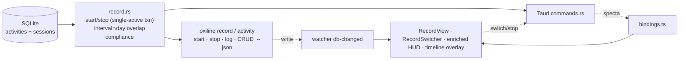

# Record Layer (Manual Time Recording + Budgets) — Design Spec

- **Date:** 2026-08-01
- **Status:** Drafted autonomously (user away); awaiting user review before implementation plan
- **Scope:** A new conceptual axis for OxiLine — recording **actual** elapsed time against named, **budgeted** activities — distinct from the existing **planned** timeline
- **Surfaces:** `oxiline-core` (new `record` module + `V4` migration + domain types) · `oxiline-cli` (new `record` + `activity` command groups) · `oxiline-app` (new Record switcher panel + enriched peek HUD + new **기록** tab + optional timeline overlay + commands + global shortcut + settings)

---

## 1. North Star & Product Constraint

### 1.1 The new axis — Plan vs Actual

OxiLine today is a pure **planning** tool. Its core metaphor is the **playhead** gliding over a scheduled *tape* of blocks (`01-product-vision.md` §1.1). "What actually happened" is captured only as a boolean done-check on a planned occurrence — there is **no memory of elapsed reality**.

This feature adds a second, independent axis: **actuals** — intervals of time the user *manually* declares they spent on a named activity, switched like macOS Screen Time's foreground-app model. The playhead already glides over the planned tape; **now it can also *record* what actually plays.** That verb — *record* — is the feature's name and the user's own word ("consume? **record**? 시간 분배?"), and it fits the playhead/tape metaphor natively in a way "consume" does not.

The two axes are **independent ledgers** that share only an optional `category` join:

| | Plan ledger (existing) | Actual ledger (new) |
|---|---|---|
| Question answered | "What did I *intend* to do?" | "What did I *actually* do?" |
| Entities | `routine_blocks`, `tasks` | `activities`, `sessions` |
| Time representation | LOCAL wall-clock, minute-of-day grid | ABSOLUTE UTC instants, second precision |
| Truth | the scheduled tape | the recorded tape |
| Surfaces | Day/Week/Backlog views, peek HUD now/next | Record switcher, 기록 tab, compliance |

**No reconciliation in v1.** The two ledgers are *not* auto-aligned (no "did this session land inside its planned block?" matching, no variance scoring). Each is an honest, separate view. Plan↔actual comparison is a designed future enhancement (§13), kept out of v1 so each system stays clean and the architecture principle holds (`04-architecture.md` §4.2: core knows neither GUI nor CLI).

### 1.2 Non-goal discipline — compliance, not gamification

Budgets + "achievement tracking" press directly against vision §1.6 ("동기부여형 앱이 아니라 실행 보조 도구") and the Phase-3 streak caveat. The `habit-streak-weekly-report` spec already fought this battle and won; this feature extends the same rule:

> Budgets are **reality feedback — a plain ratio — never a verdict.** No streaks, scores, fire/trophy, leaderboard, "budget broken," or punitive color. Over is **not** failure; met is **not** a win.

This constraint propagates into the data model (no score/streak columns), the copy ("목표 초과 +0.5h" not "예산 초과!"), and the palette discipline (§10).

### 1.3 Explicit Non-goals (v1)

- ❌ **Automatic app/window detection.** The user explicitly wants *manual* switching ("내가 직접 수동으로 전환"). Surveillance of foreground apps (RescueTime/Timing/ActivityWatch model) violates the local-first, no-spying ethos forever.
- ❌ **Streaks, scores, gamification, sharing** (vision §1.6).
- ❌ **Notifications nagging** when over/under budget.
- ❌ **Plan↔actual reconciliation/variance scoring** (future, §13).
- ❌ **Concurrent (overlay) recording** — a deliberate semantic fork, documented as future (§3.2, §13).

---

## 2. Glossary

| 한글 | Code identifier | Meaning |
|---|---|---|
| 활동 | `activity` | A predefined, switchable, **budgeted** kind of work ("코딩", "독서", "글쓰기"). First-class entity. |
| 세션 | `session` | One recorded interval of a single activity (`started_at`→`ended_at`). The unit of actual time. |
| 기록 중 | `active` / `recording` | An activity's state when it has an open session (`ended_at IS NULL`). |
| 기록(레이어) | `record` | The whole actual-time system; also the verb ("기록하다" = to record). |
| 예산 | `budget` | An activity's optional daily and/or weekly target, in minutes. |
| 충족도 | `compliance` | `spent / target` — a plain ratio, never a verdict. |
| 전환 | `switch` | Stop the current activity and start another (single-foreground). |

---

## 3. Core Semantics

### 3.1 Recording state lives in the database, not in a timer process

A session is **open** when `ended_at IS NULL`. The elapsed time is **always derived** as `now - started_at`, computed on read — there is no background ticker holding truth. Consequences:

- `start` / `stop` are **instantaneous single-row DB writes**.
- CLI and GUI share state perfectly through the SQLite file (same `04-architecture.md` §4.5 mechanism). `oxiline record start 코딩` while the GUI is closed opens a row; on next launch the GUI shows it active with correct elapsed.
- The GUI *display* ticks (elapsed counter, live compliance) via `requestAnimationFrame` writing to a DOM ref — exactly the imperative pattern already used for the NowLine (`04-architecture.md` §4.7). React state is not touched per-frame.

### 3.2 Single-active invariant — the load-bearing v1 decision

**At most one session is open at a time.** Selecting an activity always **switches**: it atomically closes the currently-open session (if any) and opens one for the chosen activity.

This is deliberate, not a limitation inherited from elsewhere:

1. **It matches the user's language.** "스크린타임" + "전환(switch)" are both single-foreground models. Screen Time records *the* foreground app, not many.
2. **It makes "시간 분배" (time *allocation*) mathematically coherent.** Non-overlapping sessions **partition the recorded portion of the day**: $\sum_{a \in \text{activities}} \text{spent}_a^{\text{day}} = \text{total recorded time} \le \text{waking hours}$. Daily budgets are therefore sound — you cannot record 30h in a day, and "remaining" means a real, allocatable quantity.
3. **It minimizes friction and surface.** One gesture switches; no "am I overlaying?" mode toggle; matches Toggl/Screen-Time expectation.

**Structural guarantee.** Every start/stop flows through `record::start` / `record::stop` in core (both CLI and GUI are thin clients over the same functions, `04-architecture.md` §4.2). `start` performs, in **one WAL transaction**:

```sql
BEGIN;
UPDATE sessions SET ended_at = :now, updated_at = :now WHERE ended_at IS NULL;
INSERT INTO sessions (id, activity_id, started_at, …) VALUES (…);
COMMIT;
```

The invariant thus holds for both clients. `current()` is **defensive**: if it ever finds more than one open row (a crash mid-transaction, or a future concurrent-write race), it keeps the most-recent `started_at` and closes the rest, returning the survivor.

**Why overlay is deferred (the conscious fork).** Allowing two activities open at once double-counts wall-clock: per-activity budgets then sum to *more* than elapsed time, and "1h remaining toward my goal" stops mapping to a real allocatable hour. Supporting overlay honestly requires a *different* accounting model (e.g., a "shared/overlap" ledger, or "primary vs background" attention weighting) — a semantic fork the user did **not** ask for in this request. It is documented as future (§13), not baked in. The single-active schema needs *no* change to adopt overlay later; only `start`'s transaction and the aggregation semantics change.

### 3.3 Time model — absolute instants, derived duration, per-day overlap

Actuals need cross-day continuity, absolute "now − started_at" elapsed, and second precision — none of which the planned ledger's local-minute-of-day grid provides. So sessions use **ISO 8601 UTC instants** (matching `created_at`'s convention, `03-data-model.md` §3.3). `duration` is **never stored**; it is `ended_at − started_at`, so it cannot drift from the timestamps.

**Daily/weekly compliance bucketing** attributes a session's minutes to local calendar days by **interval ∩ day overlap**, computed in Rust (not SQL) for clarity:

```
spent_on_date(activity, date) = Σ over sessions of max(0,
    min(end_local, day_end_local) − max(start_local, day_start_local))
```

A session 23:00→01:00 therefore credits 60 min to yesterday and 60 min to today — accurate attribution, which matters because daily compliance is the headline metric. "Today" = local date now; "this week" honors `settings.week_starts_on`. The local-date computation reuses the existing chrono local handling already in `reports.rs` / `timeline.rs`.

### 3.4 Budgets & compliance — the three neutral states

Each activity has an optional **daily** target (`target_minutes_daily`) and/or **weekly** target (`target_minutes_weekly`); either may be null (no budget ⟹ track-only, compliance omitted for that axis, not 0%).

$$\text{compliance} = \frac{\text{spent}}{\text{target}}, \qquad \text{target null} \;\Rightarrow\; \text{compliance} = \texttt{None}$$

The "did I hit the goal" line is pinned to **three neutral facts, never verdicts** (this is the boundary that keeps the feature inside vision §1.6):

| State | Condition | Copy (neutral fact) | Color |
|---|---|---|---|
| `under` | `spent < target` | "목표까지 남음 **1h10m**" | activity hue, partial fill |
| `met` | `target ≤ spent < target·1.05` | "목표 **달성**" | activity hue, full fill |
| `over` | `spent ≥ target·1.05` | "목표 **초과** +0.5h" | activity hue, full fill + overage tick |

**Critical:** `over` is **never red** and `met` is **never green/trophy**. Red (`--color-status-error`) means failure in this token system; using it for over would imply guilt. Green-success implies a "win." Instead, all three states use the **activity's own hue**; compliance is conveyed by **bar fill relative to a target tick mark**, not by a hue shift. This is the direct analogue of the habit-streak spec's "not_recorded = neutral" discipline (§5 of that spec) applied to budgets.

### 3.5 Relationship to the planned ledger

Independent by default. An activity MAY optionally reference a `category_id` (the existing color-tag entity, `03-data-model.md` §3.6) so actuals can be grouped and — in a future view — compared to planned-by-category time. There is **no** foreign key from a session to a planned `task`; sessions are not "completions" of tasks. A user may record "코딩" for 2h with or without a planned coding block existing. The two systems merely coexist.

---

## 4. Data Model — new migration `V4__record.sql`

Additive only; no change to existing tables.

```sql
-- ---- activities: the switchable, budgetable units of actual time -----------
CREATE TABLE activities (
    id                     TEXT PRIMARY KEY,          -- UUID v7
    name                   TEXT NOT NULL,
    category_id            TEXT REFERENCES categories(id) ON DELETE SET NULL,  -- optional link to the planned world
    hue_label              TEXT,                      -- 'red'|'amber'|'green'|'teal'|'blue'|'purple'; NULL → derive from category, else neutral
    icon                   TEXT,                      -- lucide name
    target_minutes_daily   INTEGER,                   -- NULL = no daily budget
    target_minutes_weekly  INTEGER,                   -- NULL = no weekly budget
    is_active              INTEGER NOT NULL DEFAULT 1,
    sort_order             INTEGER NOT NULL DEFAULT 0,
    created_at             TEXT NOT NULL,             -- ISO 8601 UTC
    updated_at             TEXT NOT NULL,
    CHECK (target_minutes_daily  IS NULL OR target_minutes_daily  BETWEEN 1 AND 1440),
    CHECK (target_minutes_weekly IS NULL OR target_minutes_weekly BETWEEN 1 AND 10080)
);
CREATE INDEX idx_activities_active ON activities(is_active);

-- ---- sessions: recorded intervals (one open at a time, §3.2) ----------------
CREATE TABLE sessions (
    id           TEXT PRIMARY KEY,                    -- UUID v7
    activity_id  TEXT NOT NULL REFERENCES activities(id) ON DELETE RESTRICT,
    started_at   TEXT NOT NULL,                       -- ISO 8601 UTC, second precision
    ended_at     TEXT,                                -- NULL = currently recording
    note         TEXT,
    created_at   TEXT NOT NULL,
    updated_at   TEXT NOT NULL,
    CHECK (ended_at IS NULL OR ended_at > started_at)
);
CREATE INDEX idx_sessions_activity ON sessions(activity_id, started_at);
CREATE INDEX idx_sessions_open     ON sessions(started_at) WHERE ended_at IS NULL;
CREATE INDEX idx_sessions_started  ON sessions(started_at);
```

Notes:
- **No `duration` column** — derived (§3.3). Storing it would let it drift from timestamps.
- **No partial-unique index enforcing "one open" at the SQL layer.** The invariant is guaranteed structurally by `record::start`'s transaction (§3.2) and defended by `current()`. A SQL-level partial unique index on a constant expression is brittle across SQLite versions; code-level enforcement through the single shared `start` entry point is the cleaner guarantee.
- **No score/streak/`is_met` columns** — compliance is derived on read (Non-goal §1.2).
- **`ON DELETE RESTRICT` + refuse-with-history.** Recorded history *is* this ledger's value, so an activity is never silently destroyed. The DB rejects the delete when sessions reference it (`activity_id` stays `NOT NULL` — no query ever handles orphans). `activity rm` refuses by default and steers to `activity toggle --off` (soft-delete via `is_active`) or `--force` (explicit, deletes the activity's sessions in the same transaction first). The rare destructive case is opt-in and visible, not the default — the right default for an actuals ledger.

New `settings` seed keys (`V4`, inserted into the existing key-value table):

| key | default | meaning |
|---|---|---|
| `record_switch_hotkey` | `"CmdOrCtrl+Shift+A"` | global shortcut for the Record switcher panel |
| `record_default_stop_on_quit` | `true` | on graceful GUI quit, close any open session |
| `record_show_overlay_on_timeline` | `true` | render recorded sessions as a translucent band on the Day timeline (§7.2) |
| `record_stale_open_hours` | `12` | an open session older than this at app start is flagged for review (§12) |

No `activities` seed data — empty, with a friendly empty state. The user defines their own (the 6 built-in `categories` exist already and may be referenced via `category_id`).

---

## 5. Core module `record.rs` — single source of truth for actual-time arithmetic

Mirrors `reports.rs`'s role: the **only** place start/stop/aggregation logic lives. CLI and GUI both call it. Pure synchronous functions; all output structs derive `specta::Type` (`#[serde(rename_all = "snake_case")]`).

### 5.1 New domain types (`model.rs`)

```rust
#[derive(Serialize, Deserialize, Type, Clone, Debug)]
pub struct Activity {
    pub id: String,
    pub name: String,
    pub category_id: Option<String>,
    pub hue_label: Option<String>,        // red|amber|green|teal|blue|purple
    pub icon: Option<String>,
    pub target_minutes_daily: Option<u32>,
    pub target_minutes_weekly: Option<u32>,
    pub is_active: bool,
    pub sort_order: i32,
}

#[derive(Serialize, Deserialize, Type, Clone, Debug)]
pub struct Session {
    pub id: String,
    pub activity_id: String,
    pub started_at: String,               // ISO 8601 UTC
    pub ended_at: Option<String>,
    pub note: Option<String>,
}

/// A currently-open session with live elapsed seconds (derived, §3.1).
#[derive(Serialize, Deserialize, Type, Clone, Debug)]
pub struct ActiveSession {
    pub session: Session,
    pub activity: Activity,
    pub elapsed_seconds: u64,             // now − started_at
}

/// Per-activity budget picture for one scope (day or week).
#[derive(Serialize, Deserialize, Type, Clone, Debug)]
pub struct Compliance {
    pub activity: Activity,
    pub spent_seconds: u64,               // Σ session overlap with the scope window
    pub target_seconds: Option<u64>,      // None ⇒ no budget for this axis
    pub ratio: Option<f64>,               // spent/target; None when target None
    pub remaining_seconds: Option<i64>,   // target − spent; negative ⇒ overage (plain, not verdict)
    pub state: ComplianceState,           // under | met | over | unbudgeted
}

#[derive(Serialize, Deserialize, Type, Clone, Debug, PartialEq)]
#[serde(rename_all = "snake_case")]
pub enum ComplianceState { Under, Met, Over, Unbudgeted }

/// What the switcher and `oxiline record` show: the active session (≤1) + today's per-activity compliance.
#[derive(Serialize, Deserialize, Type, Clone, Debug)]
pub struct RecordState {
    pub active: Option<ActiveSession>,    // None when nothing is recording
    pub today: Vec<Compliance>,           // all active activities, today scope
    pub generated_at: String,
}
```

### 5.2 Public functions (`record.rs`)

```rust
/// Switch to `activity_id` (§3.2): atomically close any open session and open a new one.
/// Returns the resulting RecordState (so the caller needs no second round-trip).
pub fn start(conn: &Connection, activity_id: &str, now: DateTime<Utc>, today: &str) -> Result<RecordState>;

/// Close the open session (if any). No-op (returns current state) when nothing is recording.
pub fn stop(conn: &Connection, now: DateTime<Utc>, today: &str) -> Result<RecordState>;

/// The open session + today's compliance. Defensive single-active repair (§3.2).
pub fn current(conn: &Connection, now: DateTime<Utc>, today: &str) -> Result<RecordState>;

/// Today's compliance for all active activities.
pub fn compliance_today(conn: &Connection, now: DateTime<Utc>, today: &str) -> Result<Vec<Compliance>>;

/// This week's compliance, honoring settings.week_starts_on.
pub fn compliance_week(conn: &Connection, now: DateTime<Utc>, today: &str) -> Result<Vec<Compliance>>;

/// Raw session list for a range/activity (the 기록 tab log view + CLI `record log`).
pub fn list_sessions(conn: &Connection, activity_id: Option<&str>, from: &str, to: &str) -> Result<Vec<Session>>;

/// Trim/extend a session's start or end (idle/crash recovery, §12).
pub fn edit_session(conn: &Connection, id: &str, started_at: Option<String>, ended_at: Option<String>) -> Result<Session>;

/// Delete a session outright.
pub fn delete_session(conn: &Connection, id: &str) -> Result<()>;

// Activity CRUD (mirrors routines:: categories:: patterns)
/// Create/update payload for activities. On update every field is optional; the double-Option on
/// targets encodes "set this axis (outer Some)" vs "clear its budget (outer Some, inner None)" —
/// needed because CLI `activity edit --daily 0` must distinguish "clear" from "leave unchanged".
#[derive(Serialize, Deserialize, Type, Clone, Debug, Default)]
pub struct ActivityInput {
    pub name: Option<String>,
    pub category_id: Option<String>,
    pub hue_label: Option<String>,
    pub icon: Option<String>,
    pub target_minutes_daily: Option<Option<u32>>,
    pub target_minutes_weekly: Option<Option<u32>>,
    pub is_active: Option<bool>,
    pub sort_order: Option<i32>,
}

pub fn create_activity(conn: &Connection, input: ActivityInput) -> Result<Activity>;
pub fn list_activities(conn: &Connection, active_only: bool) -> Result<Vec<Activity>>;
pub fn get_activity(conn: &Connection, id: &str) -> Result<Activity>;
pub fn update_activity(conn: &Connection, id: &str, input: ActivityInput) -> Result<Activity>;
pub fn delete_activity(conn: &Connection, id: &str, force: bool) -> Result<()>;   // refuses when sessions exist unless `force` (RESTRICT guard, §4)

/// Resolve "Coding" / "coding" / id → one Activity. Ambiguous name → CoreError::Ambiguous;
/// none → CoreError::NotFound. Reuses the resolution style already used for categories.
pub fn resolve_activity(conn: &Connection, id_or_name: &str) -> Result<Activity>;
```

Implementation notes:
- `spent_seconds` uses the interval∩scope-window overlap (§3.3), summed in Rust over the sessions intersecting the window.
- `now`/`today` are passed in (not read inside core) so tests are deterministic — same pattern as `reports::day_breakdown`.
- `Compliance.state` derives from `ratio`: `<1.0 → Under`, `[1.0, over_hysteresis) → Met`, `≥ over_hysteresis → Over`, target-None → `Unbudgeted`. `over_hysteresis = target * 1.05` (5%) prevents flicker at the boundary. **All states share the activity hue** — `state` only chooses the *label*, never a judgment color (§10).

---

## 6. Capture UX

### 6.1 The Record switcher — primary surface (new global shortcut)

A non-activating `tauri-nspanel` panel (reuses the `hud.rs` infra, `04-architecture.md` §4.4) opened by a **second** global shortcut, default `⌘⇧A` (the peek HUD keeps `⌘⇧O`). Unlike the 2-second peek, the switcher **stays open** until the user acts.

```
┌──────────────────────────────────────────┐
│  기록  전환                          ⎋   │  ← title + Esc hint
├──────────────────────────────────────────┤
│  ● 코딩   0:42:17                 ⏸ 멈춤 │  ← the one active session, live elapsed, mono
│  ─ ─ ─ ─ ─ ─ ─ ─ ─ ─ ─ ─ ─ ─ ─ ─ ─ ─ ─   │
│  검색…                                    │  ← type to filter (⌘K-style)
│                                          │
│  1 코딩      ▓▓▓▓▓░░░░░  2h10m / 4h  ↓2h │  ← compliance mini-bar; number = quick-select key
│  2 독서      ▓▓▓░░░░░░░  0h45m / 1h       │
│  3 글쓰기    ▓▓▓▓▓▓▓▓░░  0h50m / 1h  달성 │  ← "met" = plain label, no green/trophy
│  4 운동      ░░░░░░░░░░  0h00m / 30m      │
│  + 새 활동…                               │
└──────────────────────────────────────────┘
```

Interaction:
- **Select** (click / `↑↓`+`Enter` / digit `1`–`9`) = **switch** (§3.2): stop current, start this, dismiss with a brief confirm.
- **`␣` (space)** on the highlighted activity also switches.
- **⏸ / `⌘.`** = stop everything (close the open session).
- **`⎋` / click-away** = dismiss without changing.
- Typing filters the list by name (fuzzy not required; substring like ⌘K).
- `+ 새 활동` opens an inline create row (name + optional budget).
- Like the peek HUD, the panel **never steals focus** (`no_activate(true)`); typing in another app continues uninterrupted. Keyboard input into the panel works via the panel's own key view (same Raycast/Alfred expectation).

Empty states:
- No activities defined: "기록할 활동이 없어요. 첫 활동을 추가해보세요." + a focused create row.
- Nothing recording: the active row is replaced by "지금 기록 중인 활동이 없어요" (neutral — never "you're wasting time").

### 6.2 Enriched peek HUD (`⌘⇧O`)

The existing 2-second peek (`07-ui-screens-and-flows.md` §7.6) gains **one compact line** alongside now/next, so actuals are visible at a glance:

```
┌─────────────────────────────────────┐
│  ▓▓▓▓▓▓▓▓▓▓▓▓▓▓●──────────────────   │
│                                       │
│   지금 · 집중 작업 블록               │
│   10:28                     32분 남음 │
│   다음 · 팀 스텐드업 (11:00, 32분 후) │
│   ─ ─ ─ ─ ─ ─ ─ ─ ─ ─ ─ ─ ─ ─ ─ ─ ─  │
│   ● 녹화 중 · 코딩 0:42 · 오늘 2h10m/4h│  ← NEW: one line, mono numbers
└─────────────────────────────────────┘
```

If nothing is recording, the line reads "기록 없음 · 오늘 0h/—". It is a **single line** to honor the peek's 2-second minimalism (§7.6: "정보량을 의도적으로 최소화").

---

## 7. GUI

### 7.1 New **기록** tab (5th tab in the main window)

Adds `[오늘][주간][백로그][리포트][기록]` (keyboard `5`, extending `07-ui-screens-and-flows.md` §7.10). 420px window accommodates five short tabs. New `RecordView.tsx`; new Tauri commands (thin `#[tauri::command]` + `#[specta::specta]` + `map_err` wrappers in `commands.rs`, registered in `generate_handler!`):

```rust
pub fn record_current(state) -> Result<RecordState, String>;
pub fn record_start(state, activity_id: String) -> Result<RecordState, String>;
pub fn record_stop(state) -> Result<RecordState, String>;
pub fn record_compliance(state, scope: String /* "today"|"week" */) -> Result<Vec<Compliance>, String>;
pub fn record_list_sessions(state, activity_id: Option<String>, from: String, to: String) -> Result<Vec<Session>, String>;
pub fn record_edit_session(state, id: String, started_at: Option<String>, ended_at: Option<String>) -> Result<Session, String>;
pub fn record_delete_session(state, id: String) -> Result<(), String>;
// + activity CRUD commands (activity_list/create/update/delete)
```

tauri-specta emits TS bindings; React fetches via React Query; the existing `db-changed` watcher event (`04-architecture.md` §4.5) invalidates record query keys (CLI writes update the GUI live).

Layout (ASCII, matching project convention):

```
┌───────────────────────────────────────────────┐
│ ● ● ●   2026년 8월 1일 (금)        ⌘K  ⚙     │
│ [오늘][주간][백로그][리포트][기록]              │
├───────────────────────────────────────────────┤
│  ● 코딩   0:42:17                     ⏸ 멈춤  │  ← big active card w/ live timer
│  ─ ─ ─ ─ ─ ─ ─ ─ ─ ─ ─ ─ ─ ─ ─ ─ ─ ─ ─ ─ ─    │
│  [오늘 ▾]                                       │  ← scope toggle: 오늘 / 이번 주
│                                                │
│  코딩     ▓▓▓▓▓░░░░░░░░░  2h10m / 4h00m  1h50m │  ← full compliance bars, activity hue
│  독서     ▓▓▓░░░░░░░░░░░  0h45m / 1h00m     15m │
│  글쓰기   ▓▓▓▓▓▓▓▓▓▓░░░░░  1h05m / 1h00m  +5m   │  ← over: plain "+5m", not red
│  운동     ░░░░░░░░░░░░░░░  0h00m / 0h30m     30m │
│  ─ ─ ─ ─ ─ ─ ─ ─ ─ ─ ─ ─ ─ ─ ─ ─ ─ ─ ─ ─ ─    │
│  합계 기록 4h00m · 미배정 17h (21h 중)          │  ← partition summary vs the configured day window
│  ─ ─ ─ ─ ─ ─ ─ ─ ─ ─ ─ ─ ─ ─ ─ ─ ─ ─ ─ ─ ─    │
│  최근 세션                                      │  ← today's sessions, editable (trim/recover)
│  09:00–10:30  코딩   1h30m                   ⋯ │
│  10:30–11:15  독서   0h45m                   ⋯ │
└───────────────────────────────────────────────┘
```

The **"합계 기록 / 미배정"** line is the payoff of the single-active invariant (§3.2): because sessions partition the day, the user sees concretely how their recorded hours relate to the configured waking window (`settings.day_end_hour − day_start_hour`, default 21h) — the literal meaning of "시간 분배." It is a neutral fact (no "you only recorded 4h, do better").

### 7.2 Optional timeline overlay (the integration moment)

When `record_show_overlay_on_timeline` is on, the Day timeline (`DayTimeline.tsx`) renders recorded sessions as a **translucent vertical band** down the time rail, in each activity's hue at low alpha. This is what makes the new axis *visible* against the planned tape — at a glance you see planned blocks (solid) vs recorded reality (translucent band), and where they diverge. It is **display-only**; it does not modify the planned ledger or score variance. Toggle in Preferences (§7.3). Sessions are fetched via the same `record_list_sessions(today, today)` query and positioned by the same minute→px scale as blocks (converting UTC instants to local minutes).

### 7.3 Preferences additions

Add a **기록 (Record)** section to the Preferences slide-over (`07-ui-screens-and-flows.md` §7.8):
- Record switcher shortcut (global-hotkey recorder, same UI as the existing peek-HUD recorder).
- Default: stop-on-quit toggle.
- Show recorded-sessions overlay on Day timeline toggle.
- Stale-open-session review threshold (`record_stale_open_hours`) slider (4–24h).

### 7.4 Tray menu addition

One new line in the tray menu (`§7.7`), above the divider, mirroring the "지금" info row:

```
녹화 중: 코딩 (0:42)            ← info row when recording; "기록 안 함" when idle
────────────────────────────
기록 전환...                ⌘⇧A   ← opens the switcher
```

---

## 8. CLI

Follows `05-cli-spec.md` patterns: clap derive in `cli.rs`, `--json`, error schema §5.4, exit codes §5.5, no NLP, destructive-by-default with `--dry-run`.

```
oxiline record                                  # current state: active session + today's compliance (switcher data)
oxiline record start <ACTIVITY>                 # switch (stops previous). --at <ISO> to backdate the switch instant
oxiline record stop                             # close the open session. --at <ISO> optional
oxiline record log [--activity <A>] [--date <D>|--range FROM:TO]   # list sessions (actuals) in a range
oxiline record edit <ID> [--start <ISO>] [--end <ISO>]   # trim/extend a session (idle/crash recovery); --end now closes it
oxiline activity add <NAME> [--daily <MIN>] [--weekly <MIN>] [--category <C>] [--hue <LABEL>] [--icon <NAME>]
oxiline activity list [--active-only]
oxiline activity show <ID|NAME>
oxiline activity edit <ID|NAME> [--name …] [--daily <MIN>] [--weekly <MIN>] …   # pass --daily 0 / --weekly 0 to clear a budget
oxiline activity toggle <ID|NAME> --on|--off
oxiline activity rm <ID|NAME> [--force]   # refuses when sessions exist (history is the product); steer to `activity toggle --off`, or `--force` to delete sessions too
```

- `record` (bare) and `record start`/`stop` return `RecordState` JSON (the active session + today's `Vec<Compliance>`), so an agent needs no second call to confirm.
- `record log` returns `Session[]`; `--json` or not, it's read-only.
- `<ACTIVITY>` / `<ID|NAME>` resolve via `resolve_activity` (ambiguous name → exit 2 `invalid_argument`; none → exit 3 `not_found`).
- `--at <ISO>` lets an agent/user correct a forgotten switch retroactively ("I actually switched to 코딩 20 minutes ago") without editing a specific session id — `start --at` backdates the *new* session's `started_at` and closes the prior session at that same instant.
- All writes return the changed resource on stdout (§5.1.2).

Human-mode output (dry, factual; ko/en via `lang.rs`). Example `oxiline record`:

```
녹화 중 · 코딩  0:42:17

오늘
  코딩     2h10m / 4h    남음 1h50m
  독서     0h45m / 1h    남음 0h15m
  글쓰기   1h05m / 1h    초과 0h05m
```

Copy rule (carry from habit-streak spec): never "실패/깨짐/놓침/예산 초과!"; over renders as plain "초과 +Xm".

**Agent scenario:** a terminal agent doing a daily debrief calls `oxiline record --json` then `oxiline record log --range <week> --json` to summarize how time was actually spent vs. budgets — fully GUI-independent.

---

## 9. Data flow



GUI↔CLI sync reuses the existing §4.5 mechanism. A switch made in the GUI writes a session row; a CLI `record stop` writes another; both surface as `db-changed` → React Query invalidation of record keys. The live elapsed counter in the GUI is derived from `started_at` + `rAF`, independent of any write.

---

## 10. Design-system discipline (`06-design-system.md` / `styles.css`)

- **Compliance is hue, not verdict.** Each bar uses the activity's hue label token (`--color-hue-red|amber|green|teal|blue|purple`) or the hue derived from its `category_id`; the target is a **dashed tick mark / hairline** on the bar, not a color change. `Under`/`Met`/`Over` share the same hue — only the *fill length* and the textual state label differ. **Never** `--color-status-error` (red) for over, **never** `--color-status-success` (green) for met.
- **Overage** shown as a plain `+Xm` in `--color-text-muted` past the target tick — a fact, not an alarm.
- **Active session** card: `--color-surface-raised`, `--shadow-md`, the activity hue as a 4px left border (echoing block styling), live elapsed in `--font-mono`.
- **Switcher panel**: `--popover-radius` (`--radius-xl`), `--shadow-lg`, `--font-mono` for all timers/numbers (consistent with the "this app measures time" typography rule, §6.3).
- **Timeline overlay band**: activity hue at low alpha (`oklch(… / 0.18)` light, `0.22` dark) so it reads as a translucent second layer over solid planned blocks — never obscuring them.
- **Focus rings**, keyboard-only operability, `prefers-reduced-motion` honored (pulse/animation off) — same baseline as §6.9.

---

## 11. Testing — pure Rust, `oxiline-core/tests/record.rs`

Follows the existing `tests/reports.rs` / `tests/timeline.rs` pattern. Each test defends an observable contract:

1. **Single-active invariant** — `start(B)` while A is open closes A and opens B; exactly one open session remains. `current()` repairs a deliberately-corrupted double-open (keeps newest, closes other).
2. **Switch timestamps** — a switch at `t` yields A.ended_at == B.started_at == t (no gap, no overlap).
3. **Derived duration** — `stop` at `t1` a session started at `t0` gives duration `t1−t0`; stored rows have no duration column to contradict this.
4. **Daily compliance via interval∩day overlap** — a session crossing midnight (23:00→01:00) credits 60 min to each of the two local dates; a session wholly inside one day credits correctly.
5. **Weekly compliance** honors `week_starts_on`; a session on the boundary date lands in the right week.
6. **Compliance arithmetic** — `ratio` and `remaining_seconds` exact; `state` transitions at the 5% over-hysteresis; target-None ⇒ `Unbudgeted`, `ratio`/`remaining` None (not 0%).
7. **Partition identity** — summing `spent` across all activities for a day equals the sum of all session-overlaps that day (no double-count), the mathematical core of "시간 분배."
8. **Session edit/delete** — `edit_session` trims/extends timestamps and re-closes (ended_at must remain > started_at or error); `delete_session` removes the row.
9. **`--at` backdating** — `start --at t` sets both the new session's `started_at` and the prior session's `ended_at` to `t`.
10. **Resolution** — `resolve_activity` by exact id, exact name (case-insensitive), ambiguous name → `Ambiguous`, unknown → `NotFound`.
11. **Empty state** — no activities ⇒ `current` returns `active: None, today: []` (not an error); no budget ⇒ `Unbudgeted`.
12. **Stop idempotency** — `stop` when nothing is open is a no-op returning current state.
13. **Refuse-with-history** — `delete_activity(id, false)` on an activity with sessions → `CoreError` carrying the session count (the DB `RESTRICT` is the backstop); `delete_activity(id, true)` deletes the activity and its sessions in one transaction; `delete_activity` on an activity with no sessions succeeds without `force`.

---

## 12. Error handling & edge cases

- **Crash / ungraceful quit with an open session.** Because truth is `ended_at IS NULL`, a session left open by a crash keeps "recording" by wall-clock. On GUI launch, `current()` flags any open session older than `record_stale_open_hours` (default 12h); the switcher and 기록 tab offer a one-tap **trim** (set `ended_at` to a sensible stop) via `edit_session`. No silent truncation — the user decides.
- **Graceful GUI quit.** When `record_default_stop_on_quit` is on, `main.rs`'s close→hide intercept or tray-quit path calls `record_stop` before exit, so quitting the app stops recording predictably. (A CLI-started session, or one started then the GUI force-quit, is handled by the stale-flag path above.)
- **System sleep.** v1 does **not** auto-pause on sleep — wall-clock continues, consistent with "actuals = elapsed reality." A long sleep inflates an open session; the stale-flag + trim path is the recovery mechanism. Auto-split-on-sleep (NSWorkspace notifications) is a documented future refinement (§13), deliberately deferred to keep v1's surface small.
- **Concurrent CLI+GUI writes.** Both hold separate connections; WAL + the `start` transaction make the close-then-insert atomic. A genuine interleaving race could briefly produce two open rows; `current()`'s defensive repair (§3.2) resolves it on next read.
- **Clock changes / NTP jumps.** Backward jumps can make `ended_at < started_at`; the `CHECK` constraint rejects it and the write errors with `invalid_argument`. Forward jumps inflate a session; the trim path covers it.
- **Deleting an activity with history.** `ON DELETE RESTRICT` refuses the delete when sessions exist; `activity rm` returns a `conflict` error (exit 1, controlled refusal — not an internal fault) naming the session count and steering to `activity toggle --off` (soft-delete) or `--force` (deletes the activity and its sessions in one transaction). No silent history loss. Re-creating an activity of the same name starts fresh — history is gone only after an explicit `--force`.
- **Read-only queries** reuse `CoreError` / `ErrorCode`. Empty DB ⇒ all-zero / `None` / empty `Vec`; CLI/GUI render a friendly empty-state line (`§7.11` discipline).

---

## 13. Out of scope (future, if ever)

- **Concurrent / overlay recording (the fork, §3.2).** Allowing >1 open session double-counts wall-clock and breaks the partition identity (test 7). Adopting it requires a *different* accounting model (primary/background attention, or a separate "shared-time" ledger) and is a conscious product decision, not an incremental add. The single-active schema needs no change to support it later.
- **Plan↔actual reconciliation & variance.** Matching recorded sessions to planned blocks ("코딩 2h recorded vs 2h30m planned") and scoring variance. Compelling and unique-to-OxiLine, but heavier; deferred so each ledger ships clean first.
- **Automatic app/window detection.** Forever — violates the manual, no-surveillance ethos (§1.3).
- **Streaks / scores / gamification / sharing / budget-broken notifications.** Forever (vision §1.6).
- **Auto-split sessions on system sleep/wake.** Future refinement over the manual trim path (§12).
- **MCP exposure** of `record`/`activity` as tools — falls out free via `oxiline mcp serve` (Phase 3, `05-cli-spec.md` §5.6) once the CLI commands exist; no core change.
